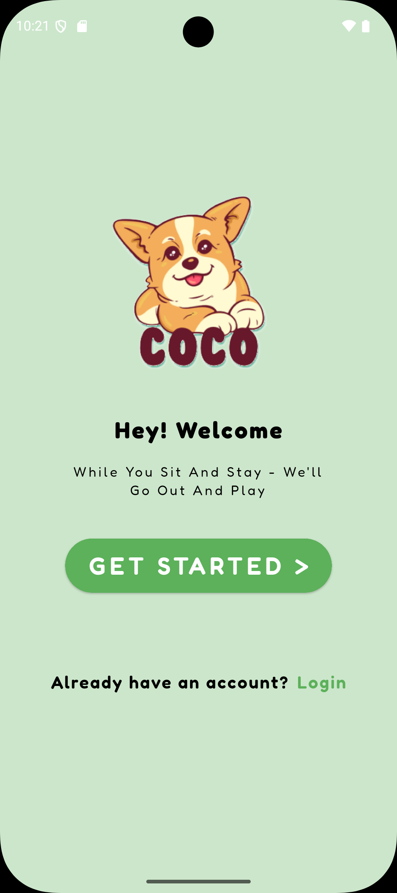
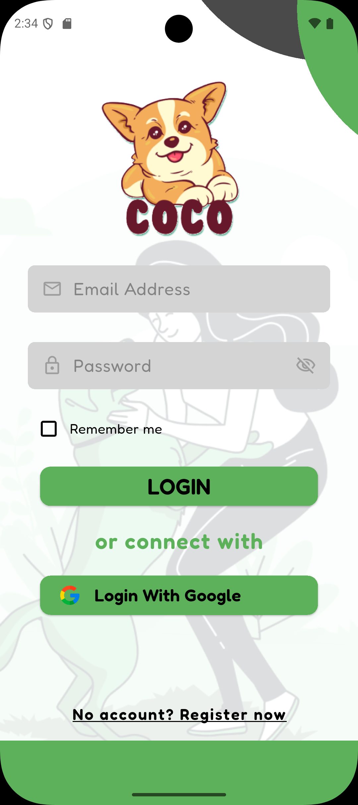
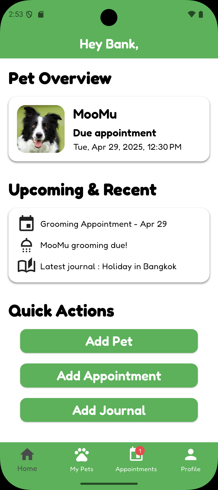
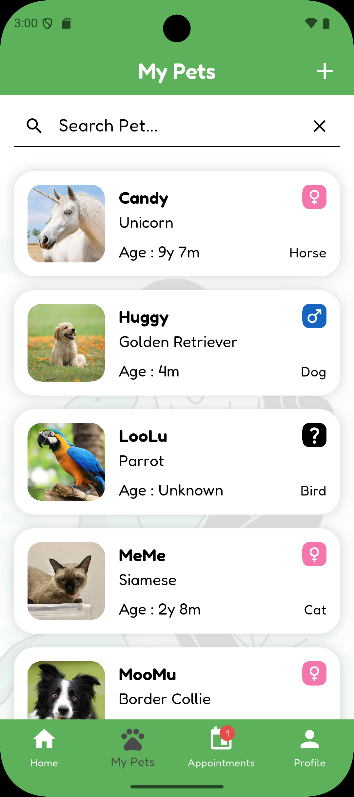
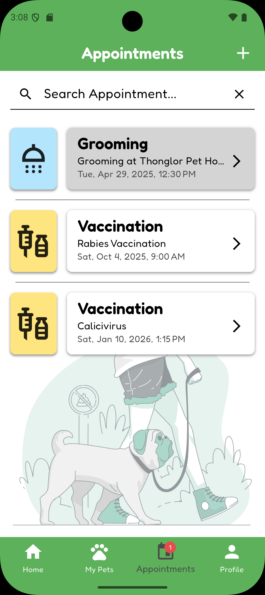
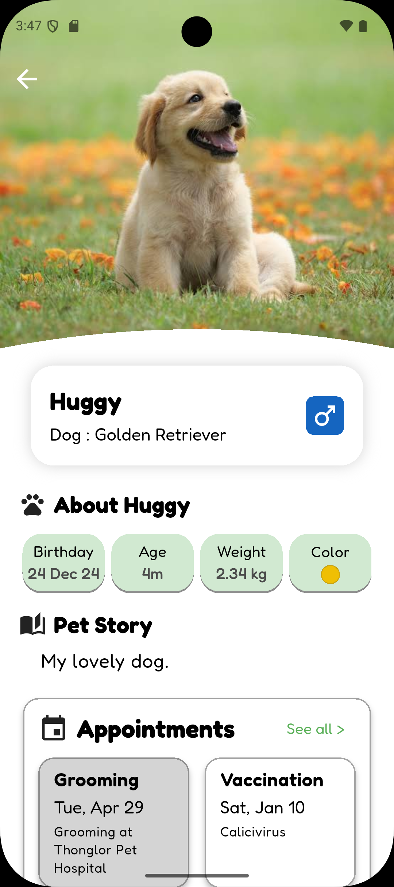
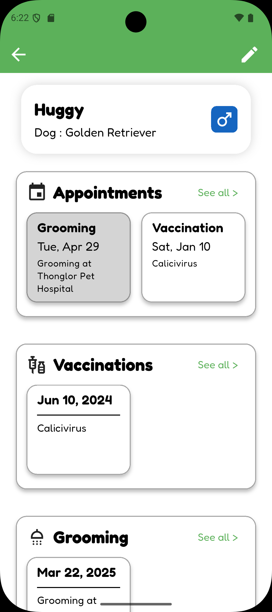

# COCO – Pet Care Management Application 🐾

A Flutter-based mobile application designed to help pet owners manage their pets' health and services. Key features include appointment scheduling, grooming & vaccine reminders, and pet profile management.

## Tech Stack
- Flutter, Dart
- Firebase (Authentication, Firestore)
- GetX (State Management & Routing)
- MVC Design Pattern

## Key Features
- Create and manage pet profiles
- Schedule appointments with status tracking
- Grooming and vaccination reminders
- Clean and accessible UI with user-centric UX

## Screenshots
### Welcome

### Login

### Home

### Pet List

### Appointment

### Pet Profile

